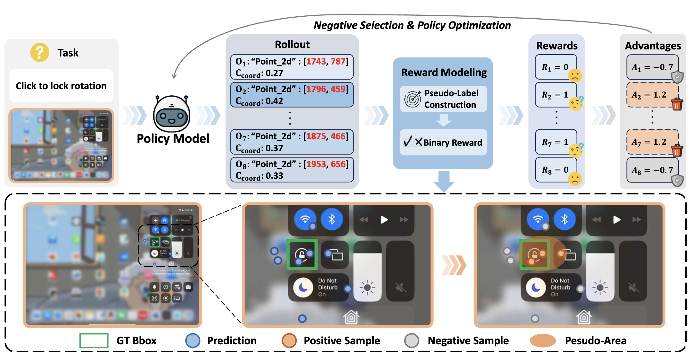

<div align="center">

<h1>Learning from Reliable Negatives: Confidence-Anchored Test-Time Adaptation for GUI Grounding</h1>


</div>


---

## Table of Contents

- [Overview](#-overview)
- [Quick Start](#-quick-start)
- [For Your Own Data](#-for-your-own-data)
- [Reward Implementation](#-reward-implementation)
- [Evaluation](#-evaluation)
- [Acknowledgement](#-acknowledgement)
- [Citation](#-citation)


## 💡 Overview



## 🚀 Quick Start
We provide an example trained on [ScreenSpot-Pro](https://github.com/likaixin2000/ScreenSpot-Pro-GUI-Grounding) for Qwen2.5-VL-3B.
### Setup

Clone this repository and set up the environment:

```bash
conda create -n canl python=3.10
conda activate canl
bash setup.sh
```

### Dataset

1. Download the [ScreenSpot-Pro](https://huggingface.co/datasets/likaixin/ScreenSpot-Pro).
2. Change the `image_folders` in [run_example.sh](./run_example.sh). The number of paths in `data_paths` and `image_folders` must be equal, with a one-to-one correspondence.
```
# Note: please use jsonl files instead of json files.
data_paths="path/to/train1.jsonl:path/to/train2.jsonl:path/to/train3.jsonl"
image_folders="path/to/ss-pro/images:path/to/ss-pro/images:path/to/ss-pro/images"
```

### Training
```bash
run_example.sh
```

## For Your Own Data
Prepare your jsonl like [dataset/pro/rl/android_studio_macos.jsonl](./dataset/pro/rl/android_studio_macos.jsonl).
```
{
  "image": "android_studio_mac/screenshot_2024-11-28_15-16-55.png", 
  "conversations": [
    {"from": "human", "value": "<image>modify the highlights of the photo with in the virtual android machine in android studio"}, 
    {"from": "gpt", "value": [1774, 1586, 2113, 1618]}
  ], 
  "width": 3840, "height": 2160
}
```
Notice: The ground-truth bboxes are **only used to calculate the pseudo-label accuracy** (Figure 4 in the paper) of CANL and output the results to logs. Ground-truth is **not utilized to compute rewards for training**. Ground-truth can be removed if you do not need to monitor the reward accuracy under pseudo-labels.
## Reward Implementation

Reward calculation function is `points2point2bbox_reward()`, in [src/open-r1-multimodal/src/open_r1/vlm_modules/qwen_module.py](./src/open-r1-multimodal/src/open_r1/vlm_modules/qwen_module.py#L224)


## Evaluation
Evaluation on ScreenSpot-V1/V2:
| Model | GUI Labels | v1 Mobile Text | v1 Mobile Icon | v1 Desktop Text | v1 Desktop Icon | v1 Web Text | v1 Web Icon | v1 Avg. | v2 Avg. |
| :--- | :---: | :---: | :---: | :---: | :---: | :---: | :---: | :---: | :---: |
| **_Proprietary Models_** | | | | | | | | | |
| GPT-4o | - | 30.5 | 23.2 | 20.6 | 19.4 | 11.1 | 7.8 | 18.8 | 20.1 |
| Claude Computer Use | - | - | - | - | - | - | - | 83.0 | - |
| **_General Models_** | | | | | | | | | |
| Qwen-2.5-VL-3B | 0 | 93.8 | 68.1 | 91.2 | 55.0 | 81.7 | 64.6 | 77.6 | 82.1 |
| Qwen-2.5-VL-7B | 0 | 91.9 | 80.8 | 88.1 | 75.7 | 90.0 | 77.7 | 84.9 | 88.1 |
| **_GUI-specific Models (Label-required)_** | | | | | | | | | |
| CogAgent-18B | 222M | 67.0 | 24.0 | 74.2 | 20.0 | 70.4 | 28.6 | 47.4 | - |
| SeeClick-9.6B | 1M | 78.0 | 52.0 | 72.2 | 30.0 | 55.7 | 32.5 | 53.4 | 55.1 |
| UGround-7B | 10M | 82.8 | 60.3 | 82.5 | 63.6 | 80.4 | 70.4 | 73.3 | 76.3 |
| OS-Atlas-7B | 13M | 93.0 | 72.9 | 91.8 | 62.9 | 90.9 | 74.3 | 82.5 | - |
| ShowUI-2B | 256K | 92.3 | 75.5 | 76.3 | 61.1 | 81.7 | 63.6 | 75.1 | 77.3 |
| Aguvis-72B | 1M | 94.5 | 85.2 | 95.4 | 77.9 | 91.3 | 85.9 | 89.2 | - |
| UI-TARS-7B | 18.4M | 94.5 | 85.2 | 95.9 | 85.7 | 90.0 | 83.5 | 89.5 | 91.6 |
| UI-TARS-72B | 18.4M | 94.9 | 82.5 | 89.7 | 88.6 | 88.7 | 85.0 | 88.4 | 90.3 |
| GUI-Actor-7B | 9.6M | 94.9 | 82.1 | 91.8 | 80.0 | 91.3 | 85.4 | 88.3 | 92.1 |
| Jedi-7B | 4M | - | - | - | - | - | - | - | 91.7 |
| UI-R1-3B | 136 | 95.6 | 84.7 | 90.2 | 59.3 | 85.2 | 73.3 | 83.3 | 85.4 |
| GUI-R1-7B | 3K | - | - | 91.8 | 73.6 | 91.3 | 75.7 | - | - |
| InfiGUI-R1-3B | 32K | 97.1 | 81.2 | 94.3 | 77.1 | 91.7 | 77.6 | 87.5 | - |
| SE-GUI-7B | 3K | - | - | - | - | - | - | 88.2 | 90.3 |
| GuirlVG-7B | 5.2K | 96.0 | 84.7 | 92.8 | 80.0 | 92.6 | 85.9 | 88.7 | 91.9 |
| **_GUI-specific Models (Label-free)_** | | | | | | | | | |
| GUI-RCPO-7B | 0 | - | - | - | - | - | - | 86.6 | 88.9 |
| **_Ours_** | | | | | | | | | |
| CAL-3B | 0 | 96.7 | 78.6 | 95.4 | 67.9 | 87.8 | 72.8 | 84.6 | 88.9 |
| CANL-3B | 0 | 96.0 | 79.0 | **96.4** | 66.4 | 87.0 | 73.8 | 84.5 | 88.5 |
| CAL-7B | 0 | **97.1** | **87.3** | 86.1 | 80.7 | **91.7** | 83.0 | 88.6 | **92.1** |
| CANL-7B | 0 | 96.7 | **87.3** | 88.6 | **82.1** | 91.3 | **84.0** | **89.2** | **92.1** |
## 🙏 Acknowledgement
The code build from [VLM-R1 project](https://github.com/om-ai-lab/VLM-R1).

## 📄 Citation
